# Roads Management Insights (RMI) Agentic Skills Suite

> **Bundle ID**: `rmi-core` | **Version**: `1.0.0`
> **Generated**: `2026-08-24 15:48:31Z`

## Overview
Curated suite of agentic skills for Roads Management Insights (RMI) development, APIs, data analytics, and operational runbooks.

---

## 🗺️ Architectural Dependency Graph

> **Status**: Current State

```mermaid
graph TD
  %% Status: Current State
  %% Convention: Strict Dependency (A --> B means A depends on / requires B)
  %% Legend: Bold Red (==>) = Explicit Hard Dependency | Dotted Gray (-.->) = Functional/Schema Dependency
  %% Bundle: Roads Management Insights (RMI) Agentic Skills Suite (rmi-core)

  subgraph tier_analytics ["4. Analytics & Visualization"]
    RMI_DATAAGENT_HELPER["rmi-dataagent-helper<br/><i>Use this skill to configure, opt...</i>"]
    RMI_DATAVIZ["rmi-dataviz<br/><i>Kepler.gl, Looker Studio & CARTO Viz</i>"]
    RMI_SQL["rmi-sql<br/><i>36 Multi-Persona Queries & Notebooks</i>"]
  end

  subgraph tier_operations ["3. Route Setting & Datasets"]
    RMI_ROUTESETTING["rmi-routesetting<br/><i>Route Registration & Snapping</i>"]
    RMI_SAMPLEDATASETS["rmi-sampledatasets<br/><i>11-Region Analytics Hub Datasets</i>"]
  end

  subgraph tier_specs ["2. RMI Specifications"]
    RMI_DATA_FOUNDATION_BIGQUERY["rmi-data-foundation-bigquery<br/><i>historical_travel_time & routes_status Schema</i>"]
    RMI_DATA_REALTIME_BIGQUERY["rmi-data-realtime-bigquery<br/><i>recent_roads_data (SRI Buffer Schema)</i>"]
    RMI_DATA_REALTIME_PUBSUB["rmi-data-realtime-pubsub<br/><i>Pub/Sub Stream Schema</i>"]
  end

  subgraph tier_foundation ["1. APIs & Core Foundations"]
    API_ANALYTICSHUB["api-analyticshub<br/><i>Analytics Hub Client</i>"]
    API_GEMINIDATAANALYTICS["api-geminidataanalytics"]
    API_ROADS_V1["api-roads-v1<br/><i>Roads API (v1 Snap & Nearest)</i>"]
    API_ROADSSELECTION["api-roadsselection<br/><i>Roads Selection API</i>"]
    API_ROUTES["api-routes<br/><i>Routes API (v2 Compute Routes)</i>"]
    BIGQUERY_GEOSPATIAL["bigquery-geospatial<br/><i>GIS & ST_ Functions</i>"]
    BIGQUERY_PRACTICES["bigquery-practices<br/><i>Partition Pruning & Best Practices</i>"]
  end

  %% EXPLICIT HARD DEPENDENCIES (Bold Red Arrows ==>)
  BIGQUERY_GEOSPATIAL ==>|HARD DEP: BigQuery Standards| BIGQUERY_PRACTICES
  RMI_DATAAGENT_HELPER ==>|HARD DEP: Declared Prerequisite| API_GEMINIDATAANALYTICS
  RMI_DATAAGENT_HELPER ==>|HARD DEP: SQL Analytics| RMI_SQL
  RMI_ROUTESETTING ==>|HARD DEP: Corridor Selection| API_ROADSSELECTION
  RMI_ROUTESETTING ==>|HARD DEP: Snap to Roads| API_ROADS_V1
  RMI_ROUTESETTING ==>|HARD DEP: Routes v2 Engine| API_ROUTES
  RMI_SAMPLEDATASETS ==>|HARD DEP: Exchange Client| API_ANALYTICSHUB
  RMI_SAMPLEDATASETS ==>|HARD DEP: BigQuery Standards| BIGQUERY_PRACTICES
  RMI_SQL ==>|HARD DEP: Spatial GIS| BIGQUERY_GEOSPATIAL
  RMI_SQL ==>|HARD DEP: BigQuery Standards| BIGQUERY_PRACTICES
  RMI_SQL ==>|HARD DEP: Warehouse Schema| RMI_DATA_FOUNDATION_BIGQUERY
  RMI_SQL ==>|HARD DEP: Real-time SRI Schema| RMI_DATA_REALTIME_BIGQUERY
  RMI_SQL ==>|HARD DEP: Sample Datasets| RMI_SAMPLEDATASETS

  %% FUNCTIONAL / SCHEMA DEPENDENCIES (Dotted Gray Arrows -.->)
  RMI_DATAVIZ -.->|reads SRI speeds| RMI_DATA_REALTIME_BIGQUERY
  RMI_DATAVIZ -.->|reads route geometries| RMI_ROUTESETTING
  RMI_DATAVIZ -.->|reads analytical layers| RMI_SQL
  RMI_DATA_FOUNDATION_BIGQUERY -.->|applies partition design| BIGQUERY_PRACTICES
  RMI_DATA_REALTIME_BIGQUERY -.->|applies buffer retention| BIGQUERY_PRACTICES
  RMI_DATA_REALTIME_BIGQUERY -.->|receives stream messages| RMI_DATA_REALTIME_PUBSUB
  RMI_ROUTESETTING -.->|provisions routes_status| RMI_DATA_FOUNDATION_BIGQUERY
  RMI_SAMPLEDATASETS -.->|implements table schema| RMI_DATA_FOUNDATION_BIGQUERY
  RMI_SAMPLEDATASETS -.->|implements table schema| RMI_DATA_REALTIME_BIGQUERY
  RMI_SQL -.->|queries stream schema| RMI_DATA_REALTIME_PUBSUB

  %% Tier Styling
  classDef tier_foundation fill:#e8f0fe,stroke:#1a73e8,stroke-width:2px,color:#174ea6;
  classDef tier_specs fill:#f3e8fd,stroke:#7b1fa2,stroke-width:2px,color:#4a148c;
  classDef tier_operations fill:#e6f4ea,stroke:#137333,stroke-width:2px,color:#0d652d;
  classDef tier_analytics fill:#fef7e0,stroke:#b06000,stroke-width:2px,color:#8a3b00;
  classDef tier_apps fill:#fce8e6,stroke:#c5221f,stroke-width:2px,color:#a50e0e;

  class RMI_SQL,RMI_DATAAGENT_HELPER,RMI_DATAVIZ tier_analytics;
  class RMI_ROUTESETTING,RMI_SAMPLEDATASETS tier_operations;
  class RMI_DATA_FOUNDATION_BIGQUERY,RMI_DATA_REALTIME_BIGQUERY,RMI_DATA_REALTIME_PUBSUB tier_specs;
  class API_ANALYTICSHUB,API_GEMINIDATAANALYTICS,API_ROADSSELECTION,API_ROADS_V1,API_ROUTES,BIGQUERY_GEOSPATIAL,BIGQUERY_PRACTICES tier_foundation;

  %% Edge Prominence Styling
  linkStyle 0,1,2,3,4,5,6,7,8,9,10,11,12 stroke:#b31412,stroke-width:3.5px;
  linkStyle 13,14,15,16,17,18,19,20,21,22 stroke:#80868b,stroke-width:1.2px,stroke-dasharray: 4 4;
```



### Rendered Architecture Visualization


---

## 🚀 Installation & Setup

You can install and consume these skills using **`npx skills` (skills.sh)**, **Zero-Config Workspace Discovery**, or **Global Symlinking**:

### Method 1: Using the `skills` CLI (`npx skills` / `skills.sh`)
The standard agent package manager ([skills.sh](https://skills.sh)) can discover and install skills scoped directly to this product folder:

```bash
# List available RMI skills (scoped to this product folder):
npx skills add https://github.com/googlemaps-samples/insights-samples/tree/main/roads_management_insights --list

# Install all RMI skills into your active project:
npx skills add https://github.com/googlemaps-samples/insights-samples/tree/main/roads_management_insights --all

# Install globally for all projects on your machine:
npx skills add https://github.com/googlemaps-samples/insights-samples/tree/main/roads_management_insights -g

# Install specific skills for target agents (e.g. Cursor, Claude Code, Antigravity):
npx skills add https://github.com/googlemaps-samples/insights-samples/tree/main/roads_management_insights --skill rmi-sql rmi-routesetting --agent cursor claude-code
```

### Method 2: Zero-Config Workspace Discovery (Monorepo Native)
AI coding assistants (Antigravity, Jetski, Gemini CLI, Cursor, Claude Code) natively support **hierarchical discovery**.
When you open this repository or work within the `roads_management_insights/` directory, the agent automatically traverses upward and registers all skills under `.agents/skills/` with zero installation:

```bash
# Simply navigate to the product folder and launch your coding agent / IDE:
cd roads_management_insights
```

### Method 3: Global Symlinking (Gemini / Jetski)
To make this RMI skills suite permanently available to all workspaces via Gemini/Jetski configuration:

```bash
# 1. Ensure your global agent skills directory exists
mkdir -p ~/.gemini/config/skills

# 2. Symlink all skills from this folder to global configuration
SKILLS_DIR="$(cd "$(dirname "${BASH_SOURCE[0]:-$0}")" && pwd)"
for skill in "${SKILLS_DIR}"/*; do
  if [ -d "${skill}" ]; then
    ln -sf "${skill}" "~/.gemini/config/skills/$(basename "${skill}")"
  fi
done
```

---

## 📦 Installed Skills Catalog

| Skill Name | Scope & Trigger Overview |
| :--- | :--- |
| [`api-analyticshub`](./api-analyticshub/SKILL.md) | Expert guidance on BigQuery Analytics Hub. Use this skill when the user asks about shared datasets, linked datasets, data exchange, subscribing to listings, or querying tables with privacy policies like AGGREGATION_THRESHOLD. Also handles resource management (CRUD operations) for Exchanges, Listings, and Subscriptions. Make sure to use this skill whenever the user mentions Analytics Hub, data sharing exchanges, creating listings, or subscribing to linked datasets. |
| [`api-geminidataanalytics`](./api-geminidataanalytics/SKILL.md) |  |
| [`api-roads-v1`](./api-roads-v1/SKILL.md) | Use this skill for the legacy Google Maps Roads API (v1). It provides procedural knowledge for 'Snap to Roads' and 'Nearest Roads'—essential for cleaning GPS traces before RMI route submission. Make sure to use this skill whenever the user mentions legacy roads, snapping GPS points, or finding the nearest physical road segments to raw coordinates. |
| [`api-roadsselection`](./api-roadsselection/SKILL.md) | Use this skill for creating, listing, retrieving, and managing SelectedRoutes (SelectedRoute) in RMI (Roads Management Insights). This includes defining routes with up to 25 intermediate waypoints, batch creation (up to 1000 routes), listing registered routes, syncing routes, and troubleshooting validation errors within authorized jurisdictions. Make sure to use this skill whenever the user mentions SelectedRoutes, SelectedRoute, registering monitored routes, roadsselection, routes of interest, routes_of_interest, sync_routes_of_interest, list routes, listing routes, or configuring RMI paths for segment telemetry. |
| [`api-routes`](./api-routes/SKILL.md) | Use this skill for pathfinding, travel time estimation, and distance matrix calculations. Essential for understanding how RMI snaps waypoints to the road network using the Routes v2 engine. Make sure to use this skill whenever the user mentions Routes API v2, route calculation, travel duration, distance matrices, or directions pathfinding. |
| [`bigquery-geospatial`](./bigquery-geospatial/SKILL.md) | Expert guidance on BigQuery Geospatial (GIS) capabilities. Use this skill when the user asks about GEOGRAPHY types, spatial functions (ST_*), proximity analysis, spatial joins, or spatial indexing (S2/H3/Quadbin) in BigQuery. |
| [`bigquery-practices`](./bigquery-practices/SKILL.md) | Foundational BigQuery best practices for SQL performance, geospatial functions, temporal engineering, BQML, vector search, storage optimization (physical vs. logical), execution diagnostics, and enterprise governance. |
| [`rmi-data-foundation-bigquery`](./rmi-data-foundation-bigquery/SKILL.md) | Use this skill for querying and analyzing the foundational RMI (Roads Management Insights) BigQuery datasets, specifically route status (routes_status) and long-term/historical traffic duration metrics (historical_travel_time). Activate when querying RMI historical datasets, managing route registration definitions, or reviewing base schema designs. |
| [`rmi-data-realtime-bigquery`](./rmi-data-realtime-bigquery/SKILL.md) | Use this skill for near real-time traffic analysis using the recent_roads_data table. This is a superset of the foundation data, enabling granular Speed Reading Interval (SRI) analysis and 60-day rolling performance audits. |
| [`rmi-data-realtime-pubsub`](./rmi-data-realtime-pubsub/SKILL.md) | Use this skill for technical details about the RMI Real-Time Pub/Sub stream, including message schema (Protobuf), key fields (SRIs, travel_duration), and integration patterns for live traffic operations. |
| [`rmi-dataagent-helper`](./rmi-dataagent-helper/SKILL.md) | Use this skill to configure, optimize, and ground BigQuery Conversational Data Agents for RMI. When invoked, helps users select a persona profile (TOM, Urban Planner, BQ Admin, Data Engineer, Data Scientist, or RMI Planner) to receive tailored grounding mantras, glossary definitions, and verified golden queries. |
| [`rmi-dataviz`](./rmi-dataviz/SKILL.md) | Best practices and procedural guidelines for designing high-performance, reactive, and visually stunning map visualizations with Deck.gl and Google Maps. |
| [`rmi-routesetting`](./rmi-routesetting/SKILL.md) | Use this skill when discussing, explaining, or implementing RMI route setting, route setting strategies, selected route setting strategies, route registration strategies, or route selection. It provides foundational strategies (SINGLE_ROUTE_UNIFORM_INTERMEDIATES, SIMPLE_ORIGIN_DESTINATION, MATCH_AND_SPLIT_BY_ROAD, BUS_ROUTE_MONITORING, BYO_POLYLINE) for transforming geographical intent into monitored SelectedRoute objects using GA-stage Routes API, Roads API (v1), and Roads Selection API. |
| [`rmi-sampledatasets`](./rmi-sampledatasets/SKILL.md) | Specialized guidance for discovering, subscribing to, and working with Roads Management Insights (RMI) public sample datasets across global metropolitan areas (Boston, Paris, Tokyo, Detroit, Manhattan, Rome, Singapore, Sydney, Buenos Aires, São Paulo State). Use when Gemini CLI needs to list available datasets from Analytics Hub via api-analyticshub, validate queries against sample data, estimate production costs based on sample baselines, or ensure correct temporal filtering for static snapshots. |
| [`rmi-sql`](./rmi-sql/SKILL.md) | Use this skill for RMI-specific SQL design, including SRI analysis, route metadata parsing, bottleneck detection, and complex traffic metrics. This is the expert guide for writing high-quality queries against RMI BigQuery datasets. |

---

## 🤖 How to Activate Skills in Conversation

Skills use **progressive disclosure** (their detailed runbooks and scripts are only loaded when triggered):
- **Natural Language Trigger**: Mention your task in conversation (e.g., *'Help me design an RMI route with 25 waypoints'*, *'Query recent speed readings from BigQuery'*, or *'Check Analytics Hub linked dataset access'*).
- **Explicit Invocation**: You can also ask the agent to specifically activate a skill by name (e.g., *'Use the rmi-routesetting skill to create routes'*).

---

## 🧹 Lifecycle & Clean Removal

Because this bundle is self-contained within this directory, removing or updating it produces **zero side-effects** on the surrounding monorepo codebase:

```bash
# To clean uninstall all skills in this product folder:
rm -rf roads_management_insights/.agents/skills
```
