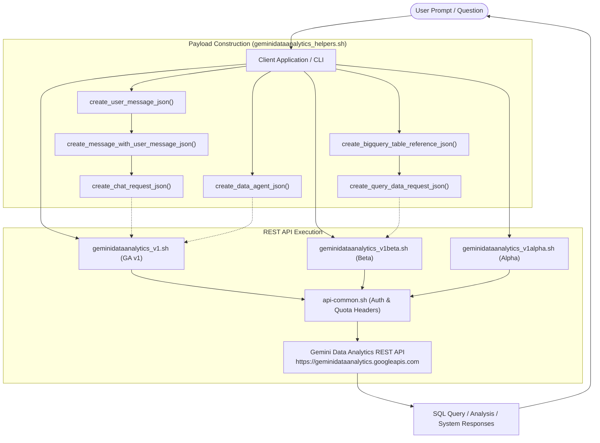

# Google Gemini Data Analytics API (geminidataanalytics)

## Overview

The Gemini Data Analytics API enables developers to build intelligent, conversational data analysis applications. It leverages Google's foundation AI models to translate natural language questions into structured queries (such as BigQuery SQL or Looker Explore parameters), execute them on connected data warehouses, and return structured insights, summaries, and visualizations.

This skill provides procedural guidelines, production REST clients (**GA `v1`**, `v1beta`, and `v1alpha`), request payload construction helpers, and multi-tiered evaluation suites for the Gemini Data Analytics API.

---

## 1. Architectural Workflow Diagram



---

## 2. Core REST Endpoints & Resources (GA v1)

The Gemini Data Analytics API exposes the following operations across GA `v1` (with beta/alpha extensions):

### 1. Conversational Chat (`projects.locations.chat`)
Processes conversational queries with optional thinking modes (`FAST`, `THINKING`) and foundation model selection.
- **Endpoint**: `POST https://geminidataanalytics.googleapis.com/v1/{parent}:chat` (where parent is `projects/*/locations/*`)

### 2. Managed Conversations (`projects.locations.conversations`)
Creates, retrieves, lists, and deletes conversation states to retain multi-turn context across sessions.
- **Endpoint**: `POST/GET/DELETE https://geminidataanalytics.googleapis.com/v1/{parent}/conversations`

### 3. Data Agents Management (`projects.locations.dataAgents`)
Configures autonomous Data Agents grounded in BigQuery tables, including asynchronous (`create`, `patch`, `delete`) and synchronous operations (`createSync`, `updateSync`, `deleteSync`).
- **Endpoint**: `POST/GET/PATCH/DELETE https://geminidataanalytics.googleapis.com/v1/{parent}/dataAgents`

### 4. Long-Running Operations (`projects.locations.operations`)
Polls, cancels, and audits long-running agent deployment and update operations.
- **Endpoint**: `GET/POST/DELETE https://geminidataanalytics.googleapis.com/v1/{parent}/operations/*`

### 5. Agent-to-Agent (A2A) Messaging (`a2a.projects.locations.dataAgents.v1`)
Enables direct inter-agent messaging and card exchange between Data Agents.
- **Endpoint**: `POST/GET https://geminidataanalytics.googleapis.com/v1/a2a/{tenant}/v1/...`

### 6. Query Translation (`projects.locations.queryData` - v1beta)
Translates natural language questions directly into database queries (BigQuery SQL, AlloyDB, Spanner, Looker).
- **Endpoint**: `POST https://geminidataanalytics.googleapis.com/v1beta/{parent}:queryData`

---

## 3. Quick Start & Operational Examples

### 1. Conversational Chat with GA v1 Client

```bash
source scripts/geminidataanalytics_v1.sh

# 1. Create a persistent conversation session
conv_payload='{"displayName": "Road Traffic Analysis Session"}'
conv=$(geminidataanalytics_v1_conversations_create "projects/my-gcp-project/locations/us-central1" "${conv_payload}" "my-gcp-project")
conv_path=$(echo "${conv}" | jq -r '.name')

# 2. Build user message and chat request with Thinking Mode enabled
umsg=$(create_user_message_json "Summarize the top 5 bottleneck corridors this morning.")
msg=$(create_message_with_user_message_json "${umsg}" "msg-1")
msgs_array=$(jq -n --argjson m "${msg}" '[$m]')
chat_payload=$(create_chat_request_json "${msgs_array}" "${conv_path}" "THINKING" "LATEST_GA_MODEL")

# 3. Send message to conversation
chat_response=$(geminidataanalytics_v1_chat "projects/my-gcp-project/locations/us-central1" "${chat_payload}" "my-gcp-project")
echo "${chat_response}" | jq '.messages[].systemMessage.text.text'
```

### 2. Manage Data Agents with Synchronous Operations (GA v1)

```bash
source scripts/geminidataanalytics_v1.sh

# 1. Build a Data Agent payload
agent_payload=$(create_data_agent_json "Fleet Telemetry Analyst" "Monitors congestion levels across delivery routes.")

# 2. Create Data Agent synchronously
agent=$(geminidataanalytics_v1_dataAgents_createSync "projects/my-gcp-project/locations/us-central1" "${agent_payload}" "fleet-analyst" "my-gcp-project")

# 3. List active Data Agents
geminidataanalytics_v1_dataAgents_list "projects/my-gcp-project/locations/us-central1" 10 "" "my-gcp-project"
```

### 3. Translate Natural Language to BigQuery SQL (`queryData` - v1beta)

```bash
source scripts/geminidataanalytics_v1beta.sh

# 1. Define target BigQuery tables
bq_table=$(create_bigquery_table_reference_json "my-gcp-project" "boston_telemetry" "routes_status")
bq_array=$(jq -n --argjson ref "${bq_table}" '[$ref]')

# 2. Build QueryDataRequest payload
query_payload=$(create_query_data_request_json "What is the average delay for route 104 in June 2026?" "${bq_array}")

# 3. Dispatch translation request
response=$(geminidataanalytics_v1beta_queryData "projects/my-gcp-project/locations/us-central1" "${query_payload}" "my-gcp-project")
echo "${response}" | jq '.executedQueryResult'
```

---

## 4. Key Guidelines & Error Recovery

- **Quota Project Header**: Always pass `project_id` to ensure `X-Goog-User-Project: <project_id>` header injection. Missing quota headers may result in `403 USER_PROJECT_DENIED`.
- **Synchronous vs Asynchronous Operations**: For immediate execution during interactive agent sessions, prefer `createSync` and `updateSync`. For large batch provisioning, use standard asynchronous endpoints and poll `projects.locations.operations`.
- **Thinking Mode**: Use `"THINKING"` for multi-table joins, complex CTEs, and aggregation analysis. Use `"FAST"` for lightweight conversational summaries.

---

## 5. Execution Strategy & Determinism Protocol

### Tier 1: Deterministic Client Scripts (Primary / Recommended)
Whenever POSIX shell execution is available, agents **MUST** prioritize using the pre-tested helper and client scripts located in `scripts/`:
- Sourcing GA v1 client: `source scripts/geminidataanalytics_v1.sh`
- Sourcing v1beta client: `source scripts/geminidataanalytics_v1beta.sh`
- Sourcing v1alpha client: `source scripts/geminidataanalytics_v1alpha.sh`
- Sourcing payload helpers: `source scripts/geminidataanalytics_helpers.sh`

*Why:* Eliminates code hallucination risks, guarantees exact ChatRequest and DataAgent payload schemas, manages OAuth2 tokens and `X-Goog-User-Project` quota headers, and automatically routes regional calls (`https://${LOCATION}-geminidataanalytics.googleapis.com`).

### Tier 2: Direct REST / Discovery Contract (Polyglot Fallback)
If executing in environments without shell access (e.g., pure Python/Node.js runtimes, notebooks, or backend microservices):
- Refer directly to the canonical Discovery Documents in `references/discoveryDocs/` (`geminidataanalytics_v1_20260815.json`, `geminidataanalytics_v1beta_20260815.json`, `geminidataanalytics_v1alpha_20260815.json`) for parameter schemas, data types, and HTTP methods.
- Issue requests directly via your runtime's native HTTP client without inventing ungrounded parameters.

---

## 6. References

- [Gemini Conversational Analytics API Overview](https://cloud.google.com/gemini/docs/conversational-analytics-api/overview)
- [Conversational Analytics REST Reference](https://cloud.google.com/gemini/docs/conversational-analytics-api/reference/rest)
- [BigQuery Natural Language Querying Guide](https://cloud.google.com/bigquery/docs/gemini-data-analytics)
- [Discovery Documents](references/discoveryDocs/)
- [Public API Discovery Document (GA v1)](https://geminidataanalytics.googleapis.com/$discovery/rest?version=v1)
- [Public API Discovery Document (v1beta)](https://geminidataanalytics.googleapis.com/$discovery/rest?version=v1beta)
- [Public API Discovery Document (v1alpha)](https://geminidataanalytics.googleapis.com/$discovery/rest?version=v1alpha)

