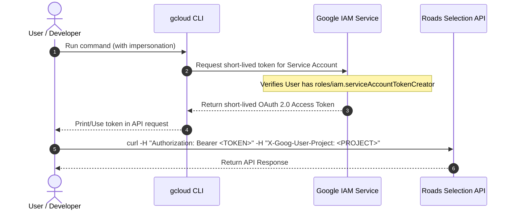

# Roads Selection API Skill

This skill provides expert guidance and specialized tools for working with the Roads Selection API v1, the administrative interface for managing monitored road segments in RMI (Roads Management Insights).

---

## 1. Core Capabilities & Constraints

The Roads Selection API manages "SelectedRoutes"—definitions of persistent paths that Google Cloud monitors to store historical and real-time traffic statistics in your BigQuery dataset.

### Technical Limits
- **Intermediate Waypoints**: A maximum of **25 intermediate waypoints** is permitted per route (excluding origin and destination).
- **Batch Creation**: You can register up to **1000 routes** in a single `batchCreate` call.
- **Modification Rule**: The API does not feature an `update` or `patch` method. To modify an existing route, you must **delete** and **re-create** it.
- **Identifier Restrictions**: Technical route IDs (`selectedRouteId`) can only contain alphanumeric characters and hyphens (`-`). **Underscores (`_`) are strictly FORBIDDEN** and cause immediate validation failures.
- **Display Name Limit (100 Bytes)**: The `displayName` field has a strict limit of **100 bytes** (not characters) in the API. Multibyte characters (such as accented characters like `ã`, `ê`, `ó` in Portuguese) occupy 2 or more bytes in UTF-8. A safe maximum length to prevent registration errors is **80 characters**.

---

## 2. IAM Roles & OAuth Authentication

To configure access and make successful calls to the Roads Selection API, you must configure the correct Identity and Access Management (IAM) roles and authorize requests using OAuth 2.0.

### Required IAM Roles
You must have either the **Owner** or **Editor** role on your Google Cloud project to manage routes. Alternatively, you can assign these specific granular roles to users or service accounts:

*   **Roads Selection Admin (`roles/roads.roadsSelectionAdmin`)**: Grants read/write access to perform all operations on selected routes.
    *   *Grant via CLI:*
        ```bash
        # For a User:
        gcloud projects add-iam-policy-binding PROJECT_ID \
          --member="user:user_email@example.com" \
          --role="roles/roads.roadsSelectionAdmin"

        # For a Service Account:
        gcloud projects add-iam-policy-binding PROJECT_ID \
          --member="serviceAccount:sa-name@PROJECT_ID.iam.gserviceaccount.com" \
          --role="roles/roads.roadsSelectionAdmin"
        ```
*   **Roads Selection Viewer (`roles/roads.roadsSelectionViewer`)**: Grants read-only access to list or retrieve selected routes.
    *   *Grant via CLI:*
        ```bash
        # For a User:
        gcloud projects add-iam-policy-binding PROJECT_ID \
          --member="user:user_email@example.com" \
          --role="roles/roads.roadsSelectionViewer"

        # For a Service Account:
        gcloud projects add-iam-policy-binding PROJECT_ID \
          --member="serviceAccount:sa-name@PROJECT_ID.iam.gserviceaccount.com" \
          --role="roles/roads.roadsSelectionViewer"
        ```

### Service Usage Requirement
Any principal (user or service account) interacting with the API must also have the **`serviceusage.services.use`** permission on the project to authorize billing and quota consumption. This permission is:
*   Inherited from **Owner** or **Editor** roles.
*   Granted via the **Service Usage Consumer** (`roles/serviceusage.serviceUsageConsumer`) role.
    *   *Grant via CLI:*
        ```bash
        # For a User:
        gcloud projects add-iam-policy-binding PROJECT_ID \
          --member="user:user_email@example.com" \
          --role="roles/serviceusage.serviceUsageConsumer"

        # For a Service Account:
        gcloud projects add-iam-policy-binding PROJECT_ID \
          --member="serviceAccount:sa-name@PROJECT_ID.iam.gserviceaccount.com" \
          --role="roles/serviceusage.serviceUsageConsumer"
        ```

### OAuth 2.0 Authorization & Headers
All REST API requests require authentication via an OAuth access token and must identify the user project:
1.  **Authorization Header**: Pass the OAuth 2.0 token as a bearer token in the `Authorization` header:
    ```http
    Authorization: Bearer YOUR_ACCESS_TOKEN
    ```
2.  **Billing Project Header**: Include the `X-Goog-User-Project` header containing the Google Cloud project ID or number to authorize quota and usage:
    ```http
    X-Goog-User-Project: PROJECT_ID
    ```

### Service Account Impersonation

Service account impersonation is a highly secure practice that allows a user (or another service account) to temporarily act as a target service account with its permissions, without needing to download or manage private JSON key files.

#### 1. Prerequisites (IAM Roles)
To impersonate a target service account, your user account (or calling principal) must have the **Service Account Token Creator** (`roles/iam.serviceAccountTokenCreator`) role on the target service account.

*   *Grant via CLI:*
    ```bash
    gcloud iam service-accounts add-iam-policy-binding \
      "sa-name@PROJECT_ID.iam.gserviceaccount.com" \
      --member="user:user_email@example.com" \
      --role="roles/iam.serviceAccountTokenCreator"
    ```

#### 2. Sequence Flow of Impersonation
The diagram below (in sync with implementation) shows the OAuth exchange that happens when you impersonate a service account to call the Roads Selection API.



#### 3. Execution Examples

##### Option A: Inline CLI Token Generation (Recommended)
You can directly generate a short-lived token impersonating the service account and pass it to your `curl` command:

```bash
# Set variables
PROJECT_ID="my-project-id"
ROUTE_ID="route-boston-01"
TARGET_SA="sa-name@${PROJECT_ID}.iam.gserviceaccount.com"

# 1. Print the access token of the impersonated service account
ACCESS_TOKEN=$(gcloud auth print-access-token --impersonate-service-account="${TARGET_SA}")

# 2. Make the API call
curl -s -X POST \
  -H "Authorization: Bearer ${ACCESS_TOKEN}" \
  -H "Content-Type: application/json" \
  -H "X-Goog-User-Project: ${PROJECT_ID}" \
  -d '{
    "displayName": "Boston Route 01",
    "dynamicRoute": {
      "origin": {"latLng": {"latitude": 42.3601, "longitude": -71.0589}},
      "destination": {"latLng": {"latitude": 42.3550, "longitude": -71.0650}}
    }
  }' \
  "https://roads.googleapis.com/selection/v1/projects/${PROJECT_ID}/selectedRoutes?selectedRouteId=${ROUTE_ID}"
```

##### Option B: Using the `GOOGLE_IMPERSONATE_SERVICE_ACCOUNT` Environment Variable
Google Cloud CLI tools, Terraform, and modern Google Cloud client libraries natively respect the `GOOGLE_IMPERSONATE_SERVICE_ACCOUNT` environment variable (for details, see the [Google Cloud Impersonation Guide](https://cloud.google.com/docs/authentication/use-service-account-impersonation)). When set, commands like `gcloud auth application-default print-access-token` will automatically return an impersonated token.

```bash
# 1. Export the target service account
export GOOGLE_IMPERSONATE_SERVICE_ACCOUNT="sa-name@my-project-id.iam.gserviceaccount.com"

# 2. Print access token (which now represents the service account)
ACCESS_TOKEN=$(gcloud auth application-default print-access-token)

# 3. Make the API call using curl or run your scripts
curl -s -X POST \
  -H "Authorization: Bearer ${ACCESS_TOKEN}" \
  -H "Content-Type: application/json" \
  -H "X-Goog-User-Project: my-project-id" \
  -d '{
    "displayName": "Boston Route 01",
    "dynamicRoute": {
      "origin": {"latLng": {"latitude": 42.3601, "longitude": -71.0589}},
      "destination": {"latLng": {"latitude": 42.3550, "longitude": -71.0650}}
    }
  }' \
  "https://roads.googleapis.com/selection/v1/projects/my-project-id/selectedRoutes?selectedRouteId=route-boston-01"
```

##### Option C: Config-level Impersonation (Persistent CLI)
To persistently impersonate a service account for all subsequent `gcloud` and `gcloud`-derived script calls in your current gcloud profile:

```bash
# Enable impersonation
gcloud config set auth/impersonate_service_account "sa-name@my-project-id.iam.gserviceaccount.com"

# Run any script or API call (tokens are automatically impersonated)
# For example, using the helper scripts in this skill:
./scripts/roads_selection_v1_util.sh

# To disable/revert impersonation:
gcloud config unset auth/impersonate_service_account
```

---

## 3. API Schema and JSON Layouts

### Create SelectedRoute Payload Structure
The main body consists of a `SelectedRoute` object wrapped inside a creation payload. The inner route includes standard metadata alongside a `dynamicRoute` (defined by origin, destination, and intermediates).

```json
{
  "displayName": "Boston Commute Route A",
  "dynamicRoute": {
    "origin": {
      "latLng": {
        "latitude": 42.3601,
        "longitude": -71.0589
      }
    },
    "destination": {
      "latLng": {
        "latitude": 42.3550,
        "longitude": -71.0650
      }
    },
    "intermediates": [
      {
        "latLng": {
          "latitude": 42.3580,
          "longitude": -71.0600
        }
      }
    ]
  }
}
```

---

## 4. Validation Rules & Troubleshooting

Always perform pre-flight checks on user inputs or generated files to avoid API-side failures:

### 1. Underscore in ID Validation
*   **Problem**: If the user provides `boston_route_01` as an ID, the API returns `INVALID_ARGUMENT`.
*   **Resolution**: Run a regex-based replacement `s/_/-/g` on the route ID before submitting.

### 2. Display Name Multibyte Byte Limit
*   **Problem**: For regional names containing non-ASCII/accented letters (e.g. Portuguese names like `São Paulo State`), names near 100 characters exceed the 100-byte limit due to UTF-8 multibyte encoding, resulting in `INVALID_ARGUMENT`.
*   **Resolution**: Programmatically truncate the `displayName` to **80 characters** (or 90 bytes) to guarantee API conformance.

### 3. Waypoint Simplification
*   **Problem**: Telemetry logs often have hundreds of coordinate points, exceeding the 25-waypoint intermediate limit.
*   **Resolution**: Apply a simplification algorithm (e.g. Douglas-Peucker) using the bundled utility `simplify_path.cjs` or warn the user to reduce waypoint frequency.

### 4. Authorized Jurisdictions & Geofencing
*   **Problem**: Registered waypoints fall outside the customer's geofenced jurisdiction contract, causing routes to report state `STATE_INVALID` with a `validationError` such as `OUT_OF_JURISDICTION` or `LOW_ROAD_USAGE`.
*   **Resolution**: Query `routes_status` table in BigQuery to check active status. No retroactive traffic data is generated for invalid routes.

### 5. macOS Command Argument Limits (ARG_MAX)
*   **Problem**: Registering batches close to the 1,000-route limit using `jq --argjson` inline payloads can fail with `Argument list too long` on macOS due to shell limit constraints (256KB).
*   **Resolution**: Always read and merge JSON structures using temporary files with `@tempfile` or file streams, rather than passing massive JSON structures as inline command string arguments.

### 6. Atomic Batch Collisions (ALREADY_EXISTS 409)
*   **Problem**: The `batchCreate` endpoint is atomic per batch. If even a single route within a batch of up to 1000 routes already exists on the project, the entire batch fails with `ALREADY_EXISTS` (409).
*   **Resolution**: Sourcing scripts must intercept `ALREADY_EXISTS` errors alongside `INVALID_ARGUMENT` errors. The calling wrapper must extract the request indices of the already-registered routes from the `fieldViolations` list in the `BadRequest` payload, exclude those routes, and dynamically retry the remaining items in the batch.

### 7. BigQuery View / Table Ingestion: Float Coercion for LatLng
*   **Problem**: When querying curated selected route views from BigQuery (e.g., `bq query --format=json`), BigQuery serializes nested `FLOAT64` coordinates inside STRUCTs as **JSON string literals** (e.g., `"latitude": "40.42278"`). If passed without type conversion, the Roads Selection API rejects the payload with `INVALID_ARGUMENT` because the `LatLng` proto requires strict numeric numbers.
*   **Resolution**: Always coerce coordinate fields to floating-point numbers (`float(val)` in Python or `tonumber` in `jq`) before packaging the `CreateSelectedRouteRequest`.

---

## 5. Error Reference and Recovery Table

| Error Message / Status | Root Cause | Exact Resolution Path |
| :--- | :--- | :--- |
| `INVALID_ARGUMENT` (ID format) | Underscore `_` used in `selectedRouteId` | Rename ID replacing `_` with `-` (e.g. `route_01` -> `route-01`). |
| `INVALID_ARGUMENT` (displayName) | `displayName` exceeds 100 bytes (common with UTF-8 Portuguese/multibyte chars) | Truncate the display name to a maximum of 80 characters. |
| `INVALID_ARGUMENT` (LatLng type) | Lat/Lng coordinates passed as strings from BigQuery JSON exports | Coerce coordinates to numeric floats (`float(lat)`, `float(lng)`). |
| `INVALID_ARGUMENT` (Too many waypoints) | Intermediates > 25 | Apply spatial path simplification or drop redundant intermediates. |
| `STATE_INVALID` / `LOW_ROAD_USAGE` | Path doesn't map to roads with enough commercial/fleet traffic | Advise the user that this specific alley/minor street is excluded from fleet statistics. |
| `OUT_OF_JURISDICTION` | Route is outside the authorized municipal boundary | Move waypoints within the municipal contract boundaries. |
| `ALREADY_EXISTS` (Conflict) | One or more routes in a `batchCreate` batch are already registered | Intercept status `ALREADY_EXISTS`, parse indices from `fieldViolations`, exclude them, and retry the remaining batch. |

---

## 6. Execution Examples (Bash & cURL)

### Single Route Registration
```bash
# Set variables
PROJECT_ID="my-project-id"
ROUTE_ID="route-boston-01"
ACCESS_TOKEN=$(gcloud auth application-default print-access-token)

curl -s -X POST \
  -H "Authorization: Bearer ${ACCESS_TOKEN}" \
  -H "Content-Type: application/json" \
  -d '{
    "displayName": "Boston Route 01",
    "dynamicRoute": {
      "origin": {"latLng": {"latitude": 42.3601, "longitude": -71.0589}},
      "destination": {"latLng": {"latitude": 42.3550, "longitude": -71.0650}}
    }
  }' \
  "https://roads.googleapis.com/selection/v1/projects/${PROJECT_ID}/selectedRoutes?selectedRouteId=${ROUTE_ID}"
```

### Batch Robust Creation & Dynamic Bisection (Utility Script)
Using the bundled high-level scripts inside this skill:
```bash
source scripts/roads_selection_v1_util.sh

# 1. Delta diffing against live registered routes:
UNREGISTERED_PAYLOAD=$(roads_selection_v1_util_diff_unregistered_routes "${PROJECT_ID}" "${PAYLOAD_JSON_ARRAY}")

# 2. Configure optional pacing delay (e.g. 0.5s sleep between batch HTTP calls):
export ROADS_PACE_DELAY=0.5

# 3. Batch-create routes with automatic field violation extraction, exponential backoff, and dynamic batch bisection:
roads_selection_v1_util_batch_create_robust "${PROJECT_ID}" "${UNREGISTERED_PAYLOAD}" "${FAILURE_LOG_PATH}"
```

### Automated Skill Verification
Run the built-in unit test suite to verify all utility functions:
```bash
./tests/test_roads_selection_v1_util.sh
```

## 7. References
- **[Roads Management Insights Overview](https://developers.google.com/maps/documentation/roads-management-insights/overview)**
- **[Roads Management Insights REST API Reference](https://developers.google.com/maps/documentation/roads-management-insights/reference/rest)**
- **[Configure Roles](https://developers.google.com/maps/documentation/roads-management-insights/configure-roles)**
- **[Google Cloud Service Account Impersonation Overview](https://cloud.google.com/iam/docs/service-account-impersonation)**
- **[Google Cloud Impersonation Guide (Application Default Credentials)](https://cloud.google.com/docs/authentication/use-service-account-impersonation)**

---

## 8. High-Throughput Pagination & Listing

When listing or synchronizing SelectedRoutes for projects with massive route definitions (e.g., projects exceeding 50,000+ routes), traditional iterative lookups are extremely inefficient and lead to programmatic API timeouts.

### Listing Best Practices & Sizing Rules

- **Use Maximum Page Sizes**: The Roads Selection API supports a maximum page size of **5000 routes** on listing requests (`pageSize=5000`). Always pass this parameter to minimize network roundtrip latencies:
  ```http
  GET https://roads.googleapis.com/selection/v1/projects/[PROJECT_ID]/selectedRoutes?pageSize=5000
  ```
- **Page-by-Page Next Token Extraction**: Always handle pagination loops by checking and parsing the `nextPageToken` string in the JSON response payload. If `nextPageToken` is present and non-empty, pass it as a query parameter (`pageToken=TOKEN`) in the subsequent request:
  ```http
  GET https://roads.googleapis.com/selection/v1/projects/[PROJECT_ID]/selectedRoutes?pageSize=5000&pageToken=CAEaJD...
  ```
- **Avoid Massive Inline Buffering**: Processing more than 10,000 routes with high-precision coordinate profiles can lead to container memory limit crashes in serverless runtimes. Always write and flush each page directly to Google Cloud Storage (GCS) as a Newline-Delimited JSON (NDJSON) `.jsonl` file on-the-fly rather than waiting for the entire loop to finish.

---

## 9. Execution Strategy & Determinism Protocol

### Tier 1: Deterministic Client Scripts (Primary / Recommended)
Whenever POSIX shell execution is available, agents **MUST** prioritize using the pre-tested helper and client scripts located in `scripts/`:
- Sourcing client: `source scripts/roads_selection_v1.sh`
- Sourcing utilities: `source scripts/roads_selection_v1_util.sh`
- Sourcing helpers: `source scripts/roads_selection_v1_helpers.sh`

*Why:* Eliminates code hallucination risks, guarantees exact SelectedRoute waypoint formatting, enforces underscore prohibition (`selectedRouteId`), handles batch bisection on validation errors, and manages OAuth2 tokens and `X-Goog-User-Project` headers automatically.

### Tier 2: Direct REST / Discovery Contract (Polyglot Fallback)
If executing in environments without shell access (e.g., pure Python/Node.js runtimes, notebooks, or backend microservices):
- Refer directly to the canonical Discovery Document in `references/discoveryDocs/generated_road_selection_v1.json` for parameter schemas, data types, and HTTP methods.
- Issue requests directly via your runtime's native HTTP client without inventing ungrounded parameters.

---

## References

- [Roads Management Insights Overview](https://developers.google.com/maps/documentation/roads-management-insights/overview)
- [Roads Management Insights REST API Reference](https://developers.google.com/maps/documentation/roads-management-insights/reference/rest)
- [Configure Roles](https://developers.google.com/maps/documentation/roads-management-insights/configure-roles)
- [Discovery Documents](references/discoveryDocs/)


