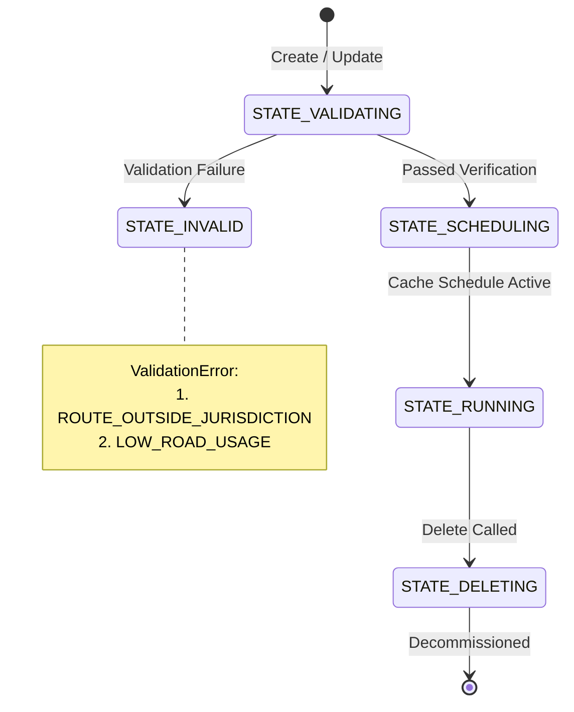

# Sample Code: Lifecycle State Tracking & Validation Error Diagnostics

This guide demonstrates how to monitor **`State`** lifecycle transitions and diagnose **`ValidationError`** causes for **`SelectedRoute`** resources in Roads Management Insights (RMI).

---

## 1. Lifecycle State Machine Architecture

When a route is created or updated, it transitions through several lifecycle stages before continuous traffic caching begins:



---

## 2. Enum Definitions & Error Reference

### `State` Enum Values (Output Only)
* **`STATE_UNSPECIFIED (0)`**: State has not been assigned.
* **`STATE_SCHEDULING (1)`**: Route passed validation; background telemetry workers are provisioning cache schedules.
* **`STATE_RUNNING (2)`**: Route has an active, continuous schedule emitting data to BigQuery and Pub/Sub.
* **`STATE_DELETING (3)`**: Route has been marked for asynchronous deletion and cleanup.
* **`STATE_VALIDATING (4)`**: Route geometry is undergoing spatial and traffic density verification.
* **`STATE_INVALID (5)`**: Route failed validation criteria (inspection of `validationError` is required).

### `ValidationError` Enum Values (Output Only when state is `STATE_INVALID`)
* **`VALIDATION_ERROR_ROUTE_OUTSIDE_JURISDICTION (1)`**:
  - *Cause*: One or more waypoints fall outside the territorial jurisdiction authorized for your GCP project.
  - *Remediation*: Adjust origin/destination coordinates to lie within contract boundaries.
* **`VALIDATION_ERROR_LOW_ROAD_USAGE (2)`**:
  - *Cause*: The requested corridor has insufficient aggregate vehicle volume to satisfy Google Maps privacy thresholds.
  - *Remediation*: Re-align route onto primary arterial or highway corridors.

---

## 3. Implementation Examples

### A. Polling for `STATE_RUNNING` with Automated Timeout (Shell)

```bash
#!/bin/bash
set -euo pipefail

source scripts/roadsselection_v1.sh
source scripts/roadsselection_v1_helpers.sh
source scripts/roadsselection_v1_util.sh

PROJECT_ID="my-roads-project"
ROUTE_ID="corridor-test-101"
ROUTE_NAME="projects/${PROJECT_ID}/selectedRoutes/${ROUTE_ID}"

# 1. Create a route
DYN_JSON=$(roadsselection_v1_dynamicroute_json 37.7749 -122.4194 37.7833 -122.4067 '[]')
ROUTE_JSON=$(roadsselection_v1_selectedroute_json "US-101 Verification Test" "${DYN_JSON}")

echo "Creating SelectedRoute '${ROUTE_ID}'..."
roadsselection_v1_selectedroute_create "${PROJECT_ID}" "${ROUTE_JSON}" "${ROUTE_ID}"

# 2. Wait for route to reach STATE_RUNNING (timeout: 60 seconds)
echo "Polling for route activation..."
if roadsselection_v1_selectedroute_wait_for_state "${ROUTE_NAME}" "STATE_RUNNING" 60; then
  echo "✅ Route is active and telemetry caching is running!"
else
  echo "❌ Route failed to reach STATE_RUNNING or entered STATE_INVALID."
  exit 1
fi
```

---

### B. Route Health Diagnostic Inspector (Python)

```python
import time
import google.auth
from google.auth.transport.requests import Request
import requests

VALIDATION_ERROR_MESSAGES = {
    "VALIDATION_ERROR_UNSPECIFIED": "No specific validation error details provided.",
    "VALIDATION_ERROR_ROUTE_OUTSIDE_JURISDICTION": "Route geometry falls outside your authorized project jurisdiction.",
    "VALIDATION_ERROR_LOW_ROAD_USAGE": "Route vehicle density is too low to satisfy Google privacy thresholds."
}

def inspect_route_health(project_id: str, route_id: str, timeout: int = 60) -> dict:
    """Polls SelectedRoute state and diagnoses validation errors."""
    credentials, _ = google.auth.default(scopes=["https://www.googleapis.com/auth/cloud-platform"])
    
    url = f"https://roads.googleapis.com/selection/v1/projects/{project_id}/selectedRoutes/{route_id}"
    start_time = time.time()

    while True:
        credentials.refresh(Request())
        headers = {
            "Authorization": f"Bearer {credentials.token}",
            "X-Goog-User-Project": project_id
        }
        res = requests.get(url, headers=headers)
        res.raise_for_status()
        data = res.json()

        state = data.get("state", "STATE_UNSPECIFIED")
        print(f"[{int(time.time() - start_time)}s] Current Route State: {state}")

        if state == "STATE_RUNNING":
            print(" Route is healthy and actively caching traffic telemetry.")
            return data

        if state == "STATE_INVALID":
            err = data.get("validationError", "VALIDATION_ERROR_UNSPECIFIED")
            desc = VALIDATION_ERROR_MESSAGES.get(err, "Unknown error")
            raise RuntimeError(f"❌ Route failed validation: {err} — {desc}")

        if time.time() - start_time > timeout:
            raise TimeoutError(f"Timed out waiting for route state after {timeout}s (Current: {state})")

        time.sleep(3)

if __name__ == "__main__":
    inspect_route_health("my-roads-project", "corridor-test-101")
```

---

### C. TypeScript (Node.js / State Poller & Error Handling)

```typescript
import { GoogleAuth } from 'google-auth-library';

const RouteState = {
  STATE_UNSPECIFIED: 'STATE_UNSPECIFIED',
  STATE_SCHEDULING: 'STATE_SCHEDULING',
  STATE_RUNNING: 'STATE_RUNNING',
  STATE_DELETING: 'STATE_DELETING',
  STATE_VALIDATING: 'STATE_VALIDATING',
  STATE_INVALID: 'STATE_INVALID',
} as const;
type RouteState = (typeof RouteState)[keyof typeof RouteState];

const ValidationError = {
  VALIDATION_ERROR_UNSPECIFIED: 'VALIDATION_ERROR_UNSPECIFIED',
  VALIDATION_ERROR_ROUTE_OUTSIDE_JURISDICTION: 'VALIDATION_ERROR_ROUTE_OUTSIDE_JURISDICTION',
  VALIDATION_ERROR_LOW_ROAD_USAGE: 'VALIDATION_ERROR_LOW_ROAD_USAGE',
} as const;
type ValidationError = (typeof ValidationError)[keyof typeof ValidationError];

interface RouteInspectionResult {
  name: string;
  state: RouteState;
  validationError?: ValidationError;
  createTime: string;
}

async function waitForRouteRunning(
  projectId: string,
  routeId: string,
  timeoutSeconds: number = 60
): Promise<RouteInspectionResult> {
  const auth = new GoogleAuth({
    scopes: ['https://www.googleapis.com/auth/cloud-platform'],
  });
  const url = `https://roads.googleapis.com/selection/v1/projects/${projectId}/selectedRoutes/${routeId}`;

  const startTime = Date.now();

  while (true) {
    const client = await auth.getClient();
    const tokenResponse = await client.getAccessToken();
    const accessToken = tokenResponse.token;

    const response = await fetch(url, {
      headers: {
        'Authorization': `Bearer ${accessToken}`,
        'X-Goog-User-Project': projectId,
      },
    });

    if (!response.ok) {
      throw new Error(`Failed to fetch route: ${response.statusText}`);
    }

    const data = (await response.json()) as RouteInspectionResult;

    if (data.state === RouteState.STATE_RUNNING) {
      return data;
    }

    if (data.state === RouteState.STATE_INVALID) {
      throw new Error(
        `Route entered ${data.state} with error: ${data.validationError ?? 'UNKNOWN'}`
      );
    }

    if ((Date.now() - startTime) / 1000 > timeoutSeconds) {
      throw new Error(`Timed out waiting for route ${routeId} to reach STATE_RUNNING (current: ${data.state})`);
    }

    await new Promise((resolve) => setTimeout(resolve, 3000));
  }
}

export { waitForRouteRunning, RouteState, ValidationError, type RouteInspectionResult };
```

---

## 4. Expected Diagnostic Response (State: `STATE_INVALID`)

```json
{
  "name": "projects/35571336328/selectedRoutes/invalid-rural-route",
  "displayName": "Low Density Rural Path",
  "dynamicRoute": {
    "origin": { "latitude": 42.1000, "longitude": -73.1000 },
    "destination": { "latitude": 42.1050, "longitude": -73.1050 }
  },
  "createTime": "2026-08-30T05:28:40.983311Z",
  "state": "STATE_INVALID",
  "validationError": "VALIDATION_ERROR_LOW_ROAD_USAGE"
}
```
