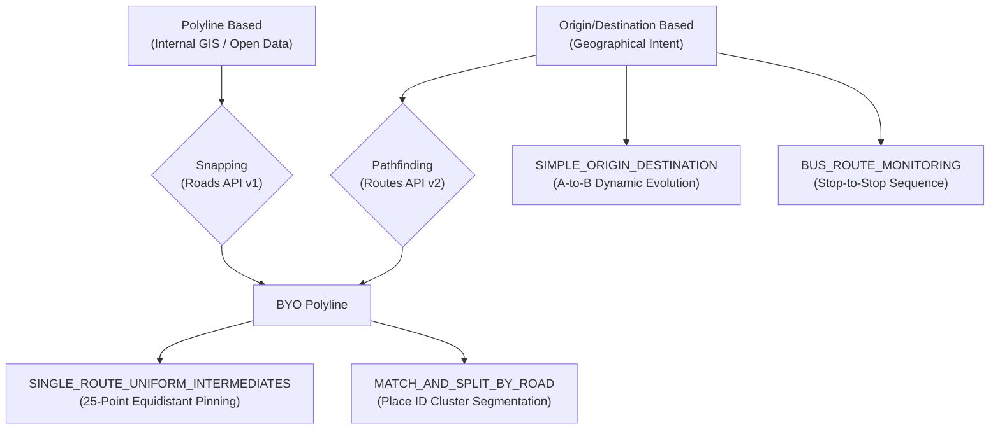

# RMI Route Setting (Technical Strategies)

This skill governs the orchestration pipeline for RMI route registration. It defines the technical strategies, algorithmic workflows, and step-by-step implementation logic used to transform geographical intent into monitored `SelectedRoute` objects on Google Maps Platform.

## Strategy Relationship Map



---

## 1. Foundational Orchestration Pipeline

The end-to-end route creation workflow coordinates three GA-stage services:

1. **Pathfinding (`api-routes`)**: Invokes `ComputeRoutes` (Routes API v2) with `routingPreference: "TRAFFIC_UNAWARE"` for a deterministic, un-congested baseline distance and duration calculation at route setting time.
   > [!NOTE]
   > **Monitoring Runtime vs. Route Setting**: While `TRAFFIC_UNAWARE` is recommended at the initial route setting stage to establish clean physical baselines, RMI internally operates using `TRAFFIC_AWARE` (not `TRAFFIC_AWARE_OPTIMAL`) during active, ongoing telemetry collection.
2. **Snapping & Alignment (`api-roads-v1`)**: Cleanses raw coordinate traces against Google's road network using `snapToRoads` or `nearestRoads`.
3. **Registration & Packaging (`api-roadsselection`)**: Constructs standard JSON/JSONL `SelectedRoute` resources with structured metadata tags and registers them via the Roads Selection API.

---

## 2. Core Registration Strategies & Implementation Steps

> [!TIP]
> **Optional Route Attributes & Downstream Utility**: All custom key-value pairs populated in `routeAttributes` are completely optional. Attribute names should be chosen deliberately based on downstream analytical utility, reporting filters, and dashboard slicing requirements (e.g., standardizing on snake_case attributes like `sampledataset`, `priority`, `route_length_meters`, `create_time`, `origin`, `destination` as used in public sample datasets).

### A. Path-Based Strategies (Heuristic & Geometry Pinning)

---

#### 1. `SIMPLE_ORIGIN_DESTINATION` (A-to-B Dynamic Route Monitoring)

* **Objective**: Monitor the end-to-end travel performance between two key geographical hubs without intermediate waypoints, allowing RMI to capture natural **path drift** (how Google Maps dynamically re-routes traffic across alternate arteries in response to real-time incidents).
* **When to Use**: High-level corridor audits (e.g. Airport-to-Downtown corridors like Manhattan to JFK/LGA/EWR), where observing alternative routing behavior is the primary analytical goal.
* **Output Scale**: 1 `SelectedRoute` per Origin-Destination pair (very low route count).
* **Implementation Steps**:
  1. **Compute Baseline Route Metrics**: Call Routes API v2 `ComputeRoutes` (`routes_computeRoutes`) with `travelMode: "DRIVE"` and `routingPreference: "TRAFFIC_UNAWARE"` to extract reference un-congested distance (`routes[0].distanceMeters`) and baseline duration (`routes[0].duration`).
  2. **Assemble SelectedRoute Dynamic Payload**: Construct the `dynamicRoute` JSON object specifying strictly the `origin` and `destination` coordinates (`latitude`, `longitude`). Leave `intermediates` empty or omitted.
  3. **Populate Contextual Metadata (`routeAttributes`)**: Attach optional downstream metadata tags (aligned with sample dataset conventions):
     - `strategy`: `"SIMPLE_ORIGIN_DESTINATION"`
     - `route_length_meters`: baseline distance string
     - `base_duration`: baseline duration string
     - `origin`: origin coordinates string (`"lat,lng"`)
     - `destination`: destination coordinates string (`"lat,lng"`)
     - `create_time`: registration timestamp string
     - `creator`: provenance tag
  4. **Register SelectedRoute**: Write payload to `${PREFIX}_selected_route.json` and submit via Roads Selection API (`createSelectedRoute`).
* **Reference Implementation Script**: [`scripts/strategy_simple_origin_destination.sh`](scripts/strategy_simple_origin_destination.sh)

---

#### 2. `SINGLE_ROUTE_UNIFORM_INTERMEDIATES` (Equidistant Waypoint Pinning)

* **Objective**: Force the RMI engine to monitor one specific physical roadway corridor without path deviation by placing up to 25 evenly spaced intermediate waypoints along the route polyline.
* **When to Use**: Trunk corridors, highways, and specific arterials where you want a single unified `SelectedRoute` entity but need to eliminate routing ambiguity across parallel roads or local shortcut diversions.
* **Output Scale**: 1 `SelectedRoute` per corridor, containing up to 25 intermediate waypoints.
* **Implementation Steps**:
  1. **Retrieve High-Quality Linestring**: Invoke Routes API v2 `ComputeRoutes` with `routingPreference: "TRAFFIC_UNAWARE"`, requesting `polylineQuality: "HIGH_QUALITY"` and `polylineEncoding: "GEO_JSON_LINESTRING"` to obtain dense coordinates grounded directly on Google's road network.
  2. **Execute Distance-Aware Existing Vertex Subsampling (Zero Synthetic Interpolation)**:
     - Compute the cumulative geodesic length $L$ along the returned coordinate sequence.
     - **Adaptive Waypoint Count**: Determine target count $N = \min(25, \lfloor L / \text{minSpacing} \rfloor)$ with a sensible spacing threshold ($\text{minSpacing} \ge 200\text{m}$) to prevent over-granular waypoints on short corridors. If $L < \text{minSpacing}$, omit intermediates ($N=0$).
     - **Sparse Vertex Retention**: If the total internal coordinate count $(M - 2) \le N$, retain all authentic internal vertices directly without downsampling.
     - **Authentic Vertex Selection**: When downsampling is required, calculate equidistant milestones $d_k = k \times \frac{L}{N+1}$ and select the **actual existing polyline vertex** closest to each milestone. Never synthesize fractional points between vertices, ensuring 100% road graph alignment.
  3. **Construct SelectedRoute Payload**: Assemble `dynamicRoute` with `origin`, the ordered array of up to 25 authentic `intermediates` (`{ latitude, longitude }`), and `destination`.
  4. **Enrich Metadata**: Tag optional `routeAttributes` with:
     - `strategy`: `"SINGLE_ROUTE_UNIFORM_INTERMEDIATES"`
     - `intermediate_count`: count of generated waypoints
     - `logic`: `"sample route vertices"`
     - `route_length_meters`: baseline length
     - `base_duration`: baseline duration
     - `create_time`: timestamp
  5. **Register & Validate**: Write payload to `${PREFIX}_selected_route.json` and verify alignment in `geospatial-viz`.
* **Reference Implementation Script**: [`scripts/strategy_single_route_uniform_intermediates.sh`](scripts/strategy_single_route_uniform_intermediates.sh)

---

#### 3. `MATCH_AND_SPLIT_BY_ROAD` (Road Segment Midpoint Pinning)

* **Objective**: Use Roads API v1 (`snapToRoads`) to divide a navigated polyline into traversed Google road segments (`placeId` clusters) and place intermediate waypoints at the **middle vertex** of each segment. Since an individual road segment does not split or fork internally, connecting single segment midpoints forms a highly efficient corridor route with zero redundant waypoints.
* **When to Use**: Arterials, urban avenues, and complex corridors where you want segment-guided intermediate waypoints without placing multiple redundant waypoints on the same uninterrupted road segment.
* **Output Scale**: 1 unified `SelectedRoute` entity pinned across traversed road segments (with adaptive capping at 25 waypoints).
* **Implementation Steps**:
  1. **Generate Path Polyline**: Query Routes API v2 `ComputeRoutes` (`TRAFFIC_UNAWARE`, `HIGH_QUALITY`) to extract the navigated coordinate sequence.
  2. **Snap Coordinates via Roads API v1**: Format polyline points as a pipe-separated string (`lat,lng|lat,lng|...`) and call `roads_v1_snapToRoads` with `interpolate=true`.
  3. **Group Contiguous Points by `placeId`**: Parse the returned `snappedPoints` array and group adjacent points sharing the same `placeId` into distinct road segment clusters.
  4. **Extract Segment Middle Vertices**:
     - For each intermediate road segment (excluding origin and destination terminal segments), pick its middle vertex (`segment.points[length / 2]`).
     - **Adaptive 25-Waypoint Limit**: If the total count of traversed internal road segments $K \le 25$, retain all $K$ segment midpoints. Only when $K > 25$, stride-subsample the segment midpoints down to 25 to respect the `SelectedRoute` quota.
  5. **Assemble SelectedRoute Payload**: Construct `dynamicRoute` with `origin`, the ordered segment midpoint `intermediates`, and `destination`.
  6. **Enrich Metadata**: Tag optional `routeAttributes` with:
     - `strategy`: `"MATCH_AND_SPLIT_BY_ROAD"`
     - `total_road_segments`: total count of traversed Google road segments
     - `intermediate_count`: count of midpoint waypoints
     - `logic`: `"road segment middle vertices"`
     - `route_length_meters` and `base_duration`: baseline metrics
     - `create_time`: timestamp
  7. **Register & Validate**: Write payload to `${PREFIX}_selected_route.json` and submit via Roads Selection API.
* **Reference Implementation Script**: [`scripts/strategy_match_and_split_by_road.sh`](scripts/strategy_match_and_split_by_road.sh)

---

### B. Use-Case Specific Strategies

---

#### 4. `BUS_ROUTE_MONITORING` (Transit Stop-to-Stop Sequence)

* **Objective**: Monitor public transit lines by registering each consecutive bus stop pair as an independent `SelectedRoute`, enabling stop-by-stop transit delay auditing and timetable reliability analysis.
* **When to Use**: Municipal bus transit networks, BRT (Bus Rapid Transit) corridors, and shuttle loops.
* **Output Scale**: $K - 1$ `SelectedRoute` objects for a bus route with $K$ consecutive stops.
* **Implementation Steps**:
  1. **Ingest GTFS / Transit Stop Sequence**: Extract ordered stop records containing `stop_id`, `stop_name`, `stop_lat`, `stop_lon`, and `stop_sequence` from GTFS feeds or agency databases.
  2. **Iterate Consecutive Stop Pairs**: For each index $i \in [1, K-1]$, define a pair from $Stop_i$ to $Stop_{i+1}$.
  3. **Optional Turn Verification**: If transit vehicles take a dedicated turn/loop between stops, query Routes API v2 between $(Stop_i, Stop_{i+1})$ to identify intermediate guidance points.
  4. **Generate SelectedRoute Object**:
     - `origin`: coordinates of $Stop_i$
     - `destination`: coordinates of $Stop_{i+1}$
     - `displayName`: `Bus Route {route_id}: {Stop_i} -> {Stop_{i+1}}`
     - `routeAttributes`: `route_id`, `trip_id`, `from_stop_id`, `to_stop_id`, `stop_sequence`
  5. **BigQuery Interval Analytics**: In BigQuery, analyze travel time progression between stops using SQL window functions (`LAG()`).

---

### C. Integration Strategies

---

#### 5. `BYO_POLYLINE` (Bring Your Own Polyline / Open GIS Ingestion)

* **Objective**: Ingest existing vector road centerlines or historical GPS traces from municipal GIS systems (ESRI Shapefile, GeoJSON, OpenStreetMap) and convert them into RMI-compliant `SelectedRoute` definitions.
* **When to Use**: Enterprise onboarding where a client provides pre-mapped road geometry assets.
* **Prerequisite Assessment (Source Data Feasibility & Alignment Check)**:
  > [!IMPORTANT]
  > **Early Geometric Overlay Assessment**: Always run an initial feasibility assessment on a representative sample of source polylines against Google Maps road network before undertaking batch ingestion.
  > - **Alignment Risk**: If the source GIS layer is derived from divergent, outdated, or low-precision coordinate geometry, automated `snapToRoads` calls can snap coordinates to adjacent parallel service roads, overpasses, or fail.
  > - **Intent-Based Recreation Alternative**: If the source network fails the alignment assessment (low geometric overlay), **do not force-snap defective polylines**. Instead, understand the original operational intent (e.g., from *Origin Zone A* to *Destination Zone B* via *Corridor C*) and recreate the route directly on Google's native road graph using Routes API v2 `ComputeRoutes` (`TRAFFIC_UNAWARE`) with strategy `SINGLE_ROUTE_UNIFORM_INTERMEDIATES` or `MATCH_AND_SPLIT_BY_ROAD`.
* **Implementation Steps**:
  1. **Source Data Feasibility Assessment**: Check spatial overlay against Google Maps road network. If divergent, pivot to Intent-Based Recreation.
  2. **Parse Vector GIS Layer**: Extract coordinate vertices from the source GIS LineString or WKT geometry.
  3. **Coordinate Snapping & Road Alignment**: Send raw coordinates through `roads_v1_snapToRoads` (`interpolate=true`) to eliminate GIS digitizing offsets and snap to Google Maps road centerlines.
  4. **Vertex Decimation (25-Point Quota)**: Downsample the snapped coordinate chain to a maximum of 25 intermediate waypoints plus origin and destination.
  5. **Assemble & Register**: Structure into standard `dynamicRoute` format and annotate optional `routeAttributes` with external asset IDs (`gis_layer`, `asset_id`, `source_crs`, `logic: "byo_gis_snapped"`).

---

## 3. Quota, Limits & Technical Constraints

| Constraint | Limit / Rule | Rationale & Handling |
| :--- | :--- | :--- |
| **Max Intermediates** | **25 waypoints** per `SelectedRoute` | Hard API limit for `dynamicRoute.intermediates`. Always apply decimation when processing dense paths. |
| **Routing Preference** | `TRAFFIC_UNAWARE` for baseline pathing | Ensures static, reproducible route geometries without temporary incident warping. |
| **Identifier Format** | Hyphens only (`[a-zA-Z0-9-]`) | Selected Route IDs must match regex constraints (4–63 chars, no underscores). |
| **Attribute Format** | `map<string, string>` (Max 10 pairs) | All attribute values must be strings (max 100 chars); numeric attributes require `SAFE_CAST()` in SQL. |

---

## 4. Analytical Patterns (BigQuery)

When analyzing stop-to-stop transit segments or subdivided corridors in BigQuery, use window functions like `LAG()` to calculate inter-stop distances and speed deltas:

```sql
SELECT 
  selected_route_id,
  JSON_VALUE(route_attributes, '$.route_id') AS transit_line,
  SAFE_CAST(JSON_VALUE(route_attributes, '$.stop_sequence') AS INT64) AS stop_seq,
  JSON_VALUE(route_attributes, '$.from_stop_id') AS from_stop,
  JSON_VALUE(route_attributes, '$.to_stop_id') AS to_stop,
  AVG(duration_in_seconds) AS avg_duration_sec,
  -- Calculate incremental distance using LAG
  ROUND(
    SAFE_CAST(JSON_VALUE(route_attributes, '$.baseDistanceMeters') AS FLOAT64) - 
    LAG(SAFE_CAST(JSON_VALUE(route_attributes, '$.baseDistanceMeters') AS FLOAT64), 1, 0.0) 
      OVER (PARTITION BY JSON_VALUE(route_attributes, '$.route_id') ORDER BY SAFE_CAST(JSON_VALUE(route_attributes, '$.stop_sequence') AS INT64)),
    2
  ) AS segment_distance_meters
FROM 
  `LINKED_DATASET_NAME.historical_travel_time` htt
JOIN 
  `LINKED_DATASET_NAME.routes_status` rs 
  ON htt.selected_route_id = rs.selected_route_id
WHERE 
  htt.record_time BETWEEN '2026-06-01' AND '2026-07-01'
GROUP BY 
  selected_route_id,
  transit_line,
  stop_seq,
  from_stop,
  to_stop,
  route_attributes;
```

