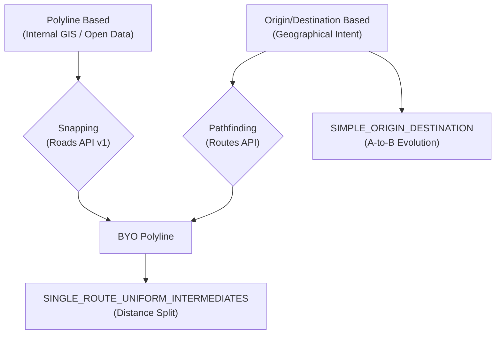

# RMI Route Setting (Technical Strategies)

This skill governs the orchestration pipeline for RMI route registration. It defines the "Strategies" used to transform geographical intent (Origin/Destination) into monitored `SelectedRoute` objects.

## Strategy Relationship Map



## 1. Foundational Orchestration
The registration pipeline typically follows these steps using GA-stage services:
1.  **Pathfinding (`api-routes`)**: Uses `ComputeRoutes` (v2) with `TRAFFIC_UNAWARE` for a stable path baseline.
2.  **Snapping (`api-roads-v1`)**: Aligns coordinates with the Google road network using the standard v1 Snap to Roads/Nearest Roads endpoints.
3.  **Registration (`api-roadsselection`)**: Constructs and submits the `SelectedRoute` object.

---

## 2. Core Registration Strategies

### A. Path-based Strategies (Heuristic)
#### SINGLE_ROUTE_UNIFORM_INTERMEDIATES
- **Goal**: Pin routes to a specific path and maintain signal granularity without topological data.
- **Logic**: Samples up to 25 equally spaced intermediate points along a path to **bias the RMI engine**.
- **Granularity**: Used to **split long corridors at reasonable intervals** (e.g., every 1km) to preserve high-fidelity signals.
- **Tool**: `scripts/strategy_single_route_uniform_intermediates.sh`

#### SIMPLE_ORIGIN_DESTINATION
- **Goal**: High-level A-to-B performance and path evolution monitoring.
- **Value**: Allows users to **observe "Path Drift"**—how the optimal route between two points changes over time.
- **Impact**: **Very Low Count**.
- **Tool**: `scripts/strategy_simple_origin_destination.sh`

### B. Use-Case Specific Strategies
#### BUS_ROUTE_MONITORING
- **Goal**: Stop-to-stop transit performance.
- **Logic**: Registers routes between consecutive bus stops or transit hubs.
- **Tool**: `scripts/strategy_bus_route_monitoring.sh`

### C. Integration Strategies
#### BYO_POLYLINE (Bring Your Own Polyline)
- **Goal**: Integrate pre-existing route data from external sources or the Routes API.
- **Tool**: `scripts/strategy_byo_polyline.sh`

---

## 3. Usage Guidelines
- **Audit**: All registered routes MUST be pushed to **`geospatial-viz`** for visual validation.
- **Identifiers**: Use hyphens, NOT underscores.
- **Limits**: Max 25 intermediate points per `SelectedRoute`.

## 4. Analytical Patterns (BigQuery)
When processing cumulative distance data, use `LAG` to calculate precise segment distances:
```sql
SELECT 
  *, 
  ROUND(Distance - LAG(Distance, 1, 0.0) OVER (ORDER BY StopSequence), 3) AS SegmentDistanceKm
FROM stops_table
```
