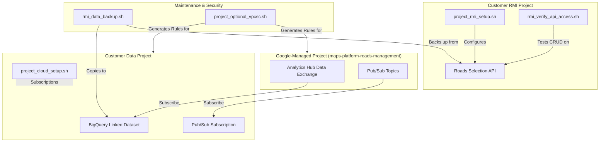

# RMI Command-line Tools

This tool provides scriptable access to the Roads Management Insights (RMI) service. It includes ready-to-use workflows and standalone API clients designed for easy integration into data pipelines and development environments.

## Architecture & Workflow

The following diagram illustrates how these scripts interact with both Google-managed and customer-managed projects:



## Getting Started

1.  **Prerequisites**:
    *   Ensure the [Google Cloud CLI (`gcloud`)](https://cloud.google.com/sdk/docs/install) is installed and in your PATH.
    *   Ensure `jq` is installed for JSON processing.

2.  **Authenticate**:
    ```bash
    gcloud auth application-default login
    ```

3.  **Make Executable**:
    ```bash
    chmod +x clients/*.sh scenarios/*.sh
    ```

## Project Awareness

A typical RMI implementation involves two distinct Google Cloud projects. Throughout this tool and its documentation, we intentionally distinguish between them to ensure operations are performed in the correct context:

1.  **RMI Project (`PROJECT_RMI_ID`)**: This is the project where you enable the **Roads Selection API** and register your **Routes of Interest**. It acts as the "Control Plane" for your RMI configuration.
2.  **Data Project (`PROJECT_CLOUD_ID`)**: This is the project where data is accumulated and consumed. It contains your **BigQuery linked datasets** (via Analytics Hub) and **Pub/Sub subscriptions** for real-time streams.

*Note: While these can be the same project, RMI's architecture allows them to be separate to satisfy different security, billing, or organizational requirements. Always verify you are using the intended Project ID for each command.*

---

## 1. Functional Scenarios (Recommended for Setup)

The most common tasks are bundled into "Scenarios" in the `scenarios/` directory. These scripts are modular; run them with `all` for a full run, or call individual `step_` functions for granular control. Call any script without arguments to see detailed usage.

### `project_rmi_setup.sh`
Configures the primary Google Cloud project for RMI API access.
*   **Action:** Enables APIs and grants `roles/roads.roadsSelectionAdmin`.
*   **Usage:** `./scenarios/project_rmi_setup.sh all <PROJECT_RMI_ID> [MEMBER]`

### `project_cloud_setup.sh`
Configures the project used for data accumulation (BigQuery) and real-time streams (Pub/Sub).
*   **Action:** Enables BigQuery/Analytics Hub APIs and provides modular helpers for subscriptions.
*   **Usage:** `./scenarios/project_cloud_setup.sh all <PROJECT_CLOUD_ID> [MEMBER]`

### `rmi_verify_api_access.sh`
Performs a complete CRUD (Create, Read, List, Delete) cycle to verify API connectivity.
*   **Action:** Creates a temporary route, verifies it, and deletes it.
*   **Usage:** `./scenarios/rmi_verify_api_access.sh all <PROJECT_RMI_ID>`

### `rmi_data_backup.sh`
Manages the preservation of your preview data.
*   **Action:** Backs up `SelectedRoutes` to JSON and copies BigQuery tables to a destination dataset or GCS.
*   **Usage:** `./scenarios/rmi_data_backup.sh all <PROJECT_RMI_ID> <PROJECT_CLOUD_ID> <SRC_DATASET_PROJ> <SRC_DATASET_NAME>`

### `project_optional_vpcsc.sh`
Generates YAML snippets for VPC Service Controls.
*   **Action:** Creates Ingress and Egress rules to allow data flow through service perimeters.
*   **Usage:** `./scenarios/project_optional_vpcsc.sh all <PROJECT_CLOUD_ID> <MEMBER_LIST>`

---

## 2. Standalone API Clients

For custom integrations, use the bundled building blocks in the `clients/` directory.

### Core Clients (Wraps raw API 1-to-1)
*   **`analyticshub_v1.sh`**: Data Exchanges and Listings.
*   **`roadsselection_v1.sh`**: Roads Selection API.
*   **`routes_v2.sh`**: Directions and Distance Matrix.

### Utility Clients (Pagination helpers)
*   **`analyticshub_v1_util.sh`**
*   **`roadsselection_v1_util.sh`**

*Example (Sourcing a Utility):*
```bash
source clients/roadsselection_v1_util.sh
# List all routes in your project
roadsselection_v1_projects_selectedRoutes_list_all "$PROJECT_RMI_ID" "100"
```

## License
Apache 2.0
